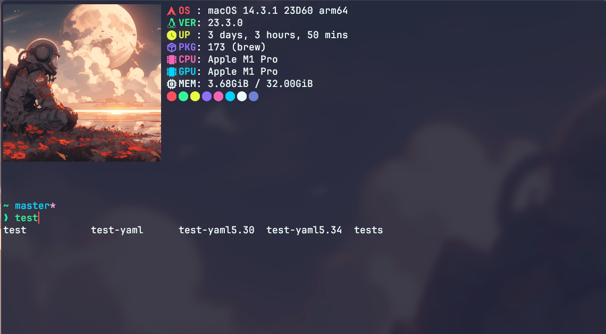
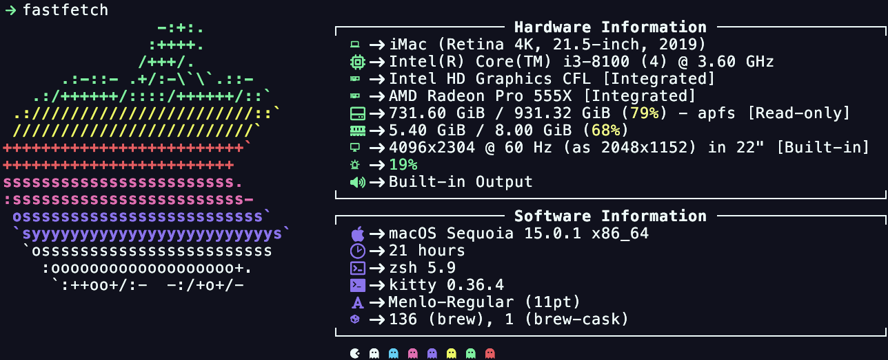

<!-- DO NOT CHANGE THIS -->

Eldritch is a community-driven dark theme inspired by Lovecraftian horror. With tones from the dark abyss and an emphasis on green and blue, it caters to those who appreciate the darker side of life.

Main Theme repo can be found [here](https://github.com/eldritch-theme/eldritch)

### Showcase
<!-- Your screenshot should go here -->
 

 

### Automatic Installation
1. Run the following command: `kitten themes`
2. Search for `Eldritch` and press `Enter`
3. This will select the theme and copy it to your kitty directory and add the include statement automatically
4. Reload kitty

### Manual Installation
1. Download the `Eldritch.conf` or `Eldritch-dark.conf` from this repository.
2. Place in your kitty config directory, usually `~/.config/kitty/`.
3. Add `include eldritch.conf` or `include eldritch-dark.conf` to your `kitty.conf` file.
4. Reload kitty
